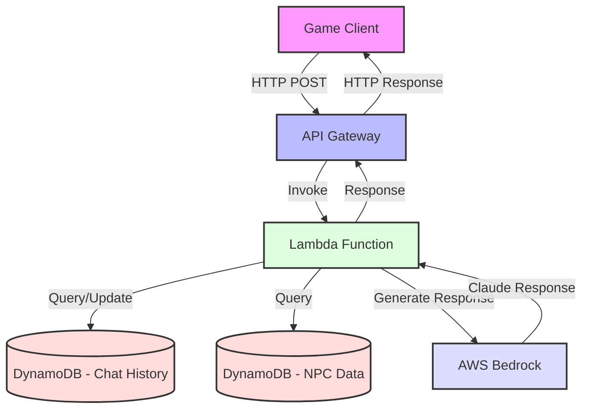

# NPC Dialogue System

A serverless NPC dialogue system using AWS Bedrock (Claude) to generate contextually aware, dynamic NPC responses in games. The system maintains conversation history and game state to provide coherent, contextual interactions.

## System Architecture


## Features

- Dynamic NPC dialogue generation using AWS Bedrock (Claude)
- Persistent conversation history
- Game state tracking
- NPC personality and background integration
- Quest state management
- Serverless architecture using AWS CDK

## Prerequisites

- Python 3.9+
- AWS Account
- AWS CLI configured
- Node.js and npm (for CDK)
- Docker (for layer building)

## Installation

1. Clone the repository:
bash
git clone https://github.com/yourusername/npc-dialogue-system.git
cd npc-dialogue-system


2. Create and activate a virtual environment:
bash
python -m venv venv
source venv/bin/activate # On Windows: venv\Scripts\activate

3. Install dependencies:
bash
pip install -r requirements.txt
npm install -g aws-cdk

4. Bootstrap CDK (if not already done):
bash
cdk bootstrap

5. Build the Lambda layer:
bash
chmod +x scripts/build_layer_docker.sh
./scripts/build_layer_docker.sh

6. Deploy the stack:
bash
cdk deploy

7. Initialize NPC data:
Get the table name
aws dynamodb list-tables --profile personal
Initialize NPC data
python npc_dialogue/scripts/initialize_npc_data.py <table_name> --profile personal


## Usage

### Testing the Endpoint

Use the provided test script:
bash
python scripts/test_dialogue_endpoint.py


Or use interactive mode:
bash
python scripts/test_dialogue_endpoint.py --interactive

### Example Request
```json
{
"game_id": "test_game_001",
"character_id": "madame_beaufort",
"player_message": "Good evening, Madame. I'm looking for a ship and crew.",
"location": "the_salty_dog_tavern",
"time_of_day": "evening",
"weather": "clear",
"player_location": "tavern_interior",
"game_state": {
"potato_quest": "unknown",
"meat_quest": "unknown",
"map_quest": "unknown",
"smuggler_quest": "unknown"
}
}
```

### Example Response
```json
{
"dialogue": "Ahoy there! Lookin' for a ship and crew, eh? Well, you've come to the right place...",
"game_state": {
"potato_quest": "unknown",
"meat_quest": "unknown",
"map_quest": "unknown",
"smuggler_quest": "unknown"
}
}
```


## Infrastructure

The system uses the following AWS services:
- API Gateway: REST API endpoint
- Lambda: Serverless function for dialogue generation
- DynamoDB: Store NPC data and chat history
- AWS Bedrock: LLM for dialogue generation
- CloudWatch: Logging and monitoring

## Development

### Project Structure
npc_dialogue/
├── lambda/ # Lambda function code
│ ├── src/ # Source code
│ └── requirements_lambda.txt # Lambda dependencies
├── lib/ # CDK stack definition
├── scripts/ # Utility scripts
├── data/ # NPC data and configurations
└── tests/ # Test files


### Adding New NPCs

1. Update `data/npc_backgrounds.json` with new NPC data
2. Run the initialization script to update DynamoDB

### Modifying the Infrastructure

1. Update the CDK stack in `lib/npc_dialogue_stack.ts`
2. Deploy changes with `cdk deploy`

## Monitoring

- View logs in CloudWatch Logs
- Monitor API Gateway metrics
- Track Lambda execution metrics
- Check DynamoDB capacity usage

## Security

- API Gateway uses API key authentication
- Lambda uses least-privilege IAM roles
- DynamoDB uses encryption at rest
- All data in transit is encrypted

## License

This project is licensed under the MIT License - see the LICENSE file for details.
